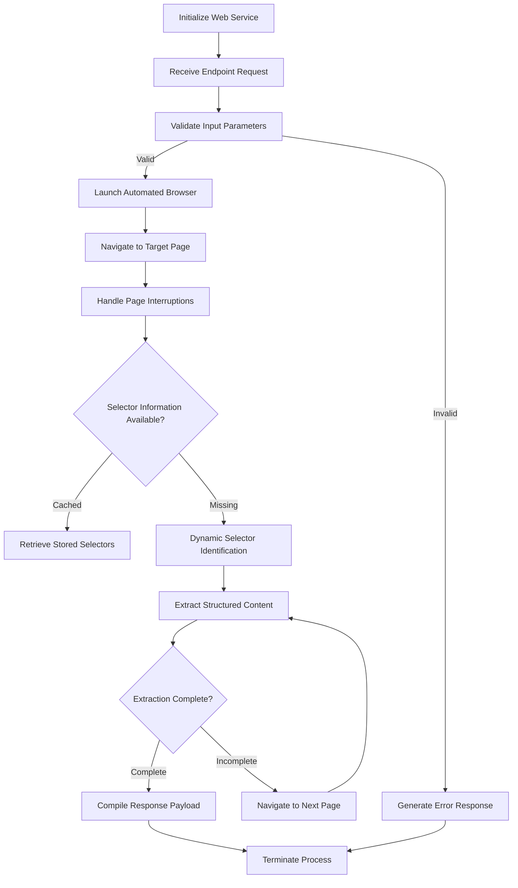

# Review Extractor

A user-friendly web app that utilizes Playwright and Gemini to gather and display product reviews from various e-commerce sites in an organized format.


## Project Flowchart



## Features
- Gathers product reviews from any e-commerce website.
- Features a sleek, responsive user interface built with React and Tailwind CSS.
- Enables real-time retrieval and display of reviews.
- Leverages Gemini LLM to automatically detect the correct CSS selectors for extracting reviews, even when dynamically generated.
- Includes functionality to navigate across all review pages, ensuring comprehensive data extraction.
- Allows configuration of a maximum review limit for user control.
- Displays star ratings with clear, visual indicators.
- Incorporates robust error handling and intuitive loading states for a seamless user experience.


## Prerequisites

- Node.js 16.x or higher
- npm or yarn
- Playwright
 ```bash
  npx playwright install chromium
  ```

## Installation

1. Clone the repository
```bash
git clone https://github.com/manish3173/Review_extractor-Gomarbel.git
cd Review_extractor-Gomarbel
```
3. Install dependencies:
```bash
npm install
```

## Running the Application

1. Create a `.env` file in the backend folder and store the `GOOGLE_API_KEY` there.```bash
```bash
PORT=8000
GOOGLE_API_KEY=your_api_key_here
 ``` 

3. Go into the backend folder, start the backend server :
```bash
node index.js
```

3. In a separate terminal, start the frontend development server:
```bash
npm run dev
```

The application will be available at:
- Frontend: http://localhost:3000
- Backend: http://localhost:8000

## Usage

- Launch the application in your browser.
- Input the product URL into the provided field.
- Specify the maximum number of reviews you want to retrieve.
- Click the "Fetch Reviews" button to begin the extraction process.
- The reviews will be displayed with the following details:
    1.Reviewer Name
    2.Star Rating
    3.Review Date 
    4.Review Content

## API Endpoints

### GET /api/reviews

Fetches reviews from a specified URL.

**Parameters:**
- `url` (required): The product URL to scrape reviews from
- `maxReviews` (optional): Maximum number of reviews to fetch

**Response:**
```json
{
  "reviews_count": number,
  "reviews": [
    {
      
      "body": string,
      "rating": number,
      "reviewer": string,
      "date": string
    }
  ]
}
```


## Error Handling

The application handles various error cases:
- Invalid URLs
- Network errors
- Timeout errors
- Missing review elements
- Server errors


