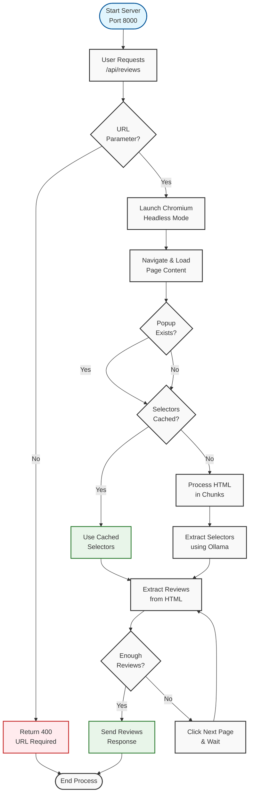

# Review Scraper

A web application that scrapes product reviews from e-commerce websites using Playwright and Ollama LLM, presenting them in a clean, organized interface.

## Overview

Review Scraper is a full-stack application that automatically extracts and displays product reviews from any e-commerce website. It uses Ollama's local LLM capabilities to dynamically identify review elements on web pages, making it adaptable to different website structures without manual configuration.

## Project Flow


The flow diagram illustrates the complete process from server initialization to review extraction, with color coding for different states:
* Blue: Entry points
* Red: Error states
* Green: Successful operations
* Gray: Standard process steps

## Features
* Automated review extraction from any e-commerce website
* Dynamic CSS selector identification using local LLM
* Real-time review fetching and display
* Multi-page review navigation
* Configurable review limits
* Star rating visualization
* Comprehensive error handling
* Clean, responsive UI

## Tech Stack

**Frontend:**
* React
* Tailwind CSS
* Vite

**Backend:**
* Node.js
* Express.js
* Playwright
* Ollama (Local LLM)

## Prerequisites
* Node.js 16.x or higher
* npm or yarn
* Playwright Chromium:
```bash
npx playwright install chromium
```

## Installation of Ollama

### 1. Install Ollama
Download and install Ollama from [ollama.ai/download](https://ollama.ai/download).

Pull the Mistral model:

```bash
ollama pull mistral
```
# Review Scraper Application

## Installation

### 1. Clone the Repository
Clone the project repository:

```bash
git clone [repository-url]
cd review-scraper
```
# Review Scraper Application

## Installation

### Step 1: Install Dependencies
Install the required dependencies:

```bash
npm install
```
2. Go into the backend folder, start the backend server :
```bash
node index.js
```

3. In a separate terminal, start the frontend development server:
```bash
npm run dev
```

The application will be available at:
- Frontend: http://localhost:3000
- Backend: http://localhost:8000

## Usage

1. Open the application in your browser
2. Enter a product URL in the input field
3. Set the maximum number of reviews to fetch
4. Click "Get Reviews" to fetch and display the reviews
5. Reviews will be displayed with:
   - Reviewer name
   - Rating (in stars)
   - Review date
   - Review content

## API Endpoints

### GET /api/reviews

Fetches reviews from a specified URL.

**Parameters:**
- `url` (required): The product URL to scrape reviews from
- `maxReviews` (optional): Maximum number of reviews to fetch

**Response:**
```json
{
  "reviews_count": number,
  "reviews": [
    {
      "body": string,
      "rating": number,
      "reviewer": string,
      "date": string
    }
  ]
}
```

## Test Pages

To test the implementation, here are some example product pages:

- [2717 Recovery Cream](https://2717recovery.com/products/recovery-cream)
- [Bhumi Sateen Sheet Set - Orion Blue](https://bhumi.com.au/products/sateen-sheet-set-orion-blue?variant=46405869076637)
- [Bhumi Blissful Ritual Twill Bath Sheet Bundle](https://bhumi.com.au/products/organic-cotton-blissful-ritual-twill-bath-sheet-bundle)


## Error Handling

The application handles various error cases:
- Invalid URLs
- Network errors
- Timeout errors
- Missing review elements
- Server errors

## Contributing

1. Fork the repository
2. Create a feature branch
3. Commit your changes
4. Push to the branch
5. Open a Pull Request

## License

Feel free to use this project for any purpose.

